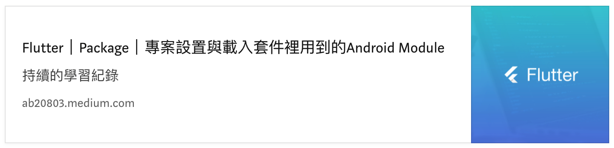

# 網易七魚客服


Flutter目前官方沒有支援，所以自行實作原生SDK，製作 Flutter Package

-------------------

## 如何使用？
### 初始化
- appKey ➤ 七魚後台給予APP接入的金鑰
- appName ➤ 七魚後台設置接入APP的名稱
- deviceIdentifier ➤ 用戶裝置的ID，主要是設置後，七魚在客服的推播會附帶此資料，我們伺服器後端收到後可以經由此ID取得對應的推播Token(例如：Fcm Token)，經由Token送出推播訊息給用戶
``` dart
String appKey = 'd433ac25ced4170d98a66b3eda15es12';
String appName = 'qiyu-plugin-example';
String deviceIdentifier = 'AAAAAABBBBBBBBCCCCDDDDD';
await Qiyu.initialize(
    appKey: appKey, appName: appName, deviceIdentifier: deviceIdentifier);
```
- 套件 ➤ 取得設備資訊 ➤ [device_info](https://pub.dev/packages/device_info)

### 用戶資訊
幫用戶設置多種個人資訊，每個資訊為一個物件，最終給予物件陣列的Json字串
<br/>
```姓名、手機、信箱為預設的資料欄位，其他需要自行補充```

- index ➤ 用於排序，顯示數據時數據項按index值升序排列；不設定index的數據項將排在後面；index相同或未設定的數據項將按照其在JSON 中出現的順序排列。
- key ➤ 數據項的名稱，用於區別不同的數據
- value ➤ 該數據顯示的值，類型不做限定，根據實際需要進行設定
- label ➤ 該項數據顯示的名稱
- href ➤ 超鏈接地址。若指定該值，則該項數據將顯示為超鏈接樣式，點擊後跳轉到其值所指定的URL地址
- hidden ➤ 是否隱藏該item。目前僅對mobile和email有效

``` dart
class QiyuUserInfoData {

  static const keyName = 'real_name';
  static const keyPhone = 'mobile_phone';
  static const keyEmail = 'email';

  int? index;
  String key;
  String value;
  String label;
  String? href;
  bool hidden;

  QiyuUserInfoData({
    this.index,
    required this.key,
    required this.value,
    required this.label,
    this.href,
    this.hidden = false,
  });

  factory QiyuUserInfoData.fromJson(Map<String, dynamic> json) => _$QiyuUserInfoDataFromJson(json);
  Map<String, dynamic> toJson() => _$QiyuUserInfoDataToJson(this);
}

```

### 登入，設置用戶資訊
- userId ➤ 識別用戶的唯一ID
- userInfoDataList ➤ 用戶資訊的清單
``` dart
await Qiyu.setUserInfo(userId: 'yii555', userInfoDataList: list);
```
```注意：記得切換用戶的時候要先登出後再進行登入```

### 登出
``` dart
final bool isLogoutSuccess = await Qiyu.logoutUser();
```

### 設置裝置ID
``` dart
Qiyu.setDeviceIdentifier(deviceIdentifier: deviceIdentifier);
```

### 開啟客服頁面
``` dart
Qiyu.showCustomerService();
```


-------------------

### 範例
``` dart
  @override
  void initState() {
    super.initState();
    runQiyu();
  }

  Future<void> runQiyu() async {
    // 取得設備ID
    String deviceIdentifier = '';
    final DeviceInfoPlugin deviceInfo = DeviceInfoPlugin();
    if (Platform.isIOS) {
      final IosDeviceInfo iosDevice = await deviceInfo.iosInfo;
      deviceIdentifier = iosDevice.identifierForVendor;
    } else if (Platform.isAndroid) {
      final AndroidDeviceInfo androidDevice = await deviceInfo.androidInfo;
      deviceIdentifier = androidDevice.androidId;
    }
    // 初始化
    await Qiyu.initialize(
        appKey: 'd433ac25ced4170d98a66b3eda15es12', appName: 'qiyu-plugin-example', deviceIdentifier: deviceIdentifier);
    // 設置用戶或更新用戶之前必須確保已經將用戶登出
    final bool isLogoutSuccess = await Qiyu.logoutUser();
    if (isLogoutSuccess) {
      // 設置用戶資訊
      List<QiyuUserInfoData> list = [];
      list.add(QiyuUserInfoData(key: QiyuUserInfoData.keyName, value: 'Test(555)', label: '名字'));
      list.add(QiyuUserInfoData(key: QiyuUserInfoData.keyPhone, value: '0939552555', label: '電話'));
      list.add(QiyuUserInfoData(key: QiyuUserInfoData.keyEmail, value: '555@gmail.com', label: '信箱'));
      list.add(QiyuUserInfoData(key: 'city', value: 'Taipei', label: '城市', index: 0));
      await Qiyu.setUserInfo(userId: 'yii555', userInfoDataList: list);
    }
  }
```

--------------

## 問題
- SDK修復包，5.7.9，整合至Flutter App專案時，遇到Flutter找不到Android Module的問題。
解決方法請查看下方↓


## 連結
- [網易七魚](https://qiyukf.com/)
- [下載](https://qiyukf.com/download)
- [Android開發](https://qiyukf.com/docs/guide/android/)
- [iOS開發](https://qiyukf.com/docs/guide/ios/)

## 關於我
- Medium：[Yii Chen](https://ab20803.medium.com/)
- Youtube：[Yii](https://www.youtube.com/user/a22601807/videos)
- Email：<ab20803@gmail.com>
